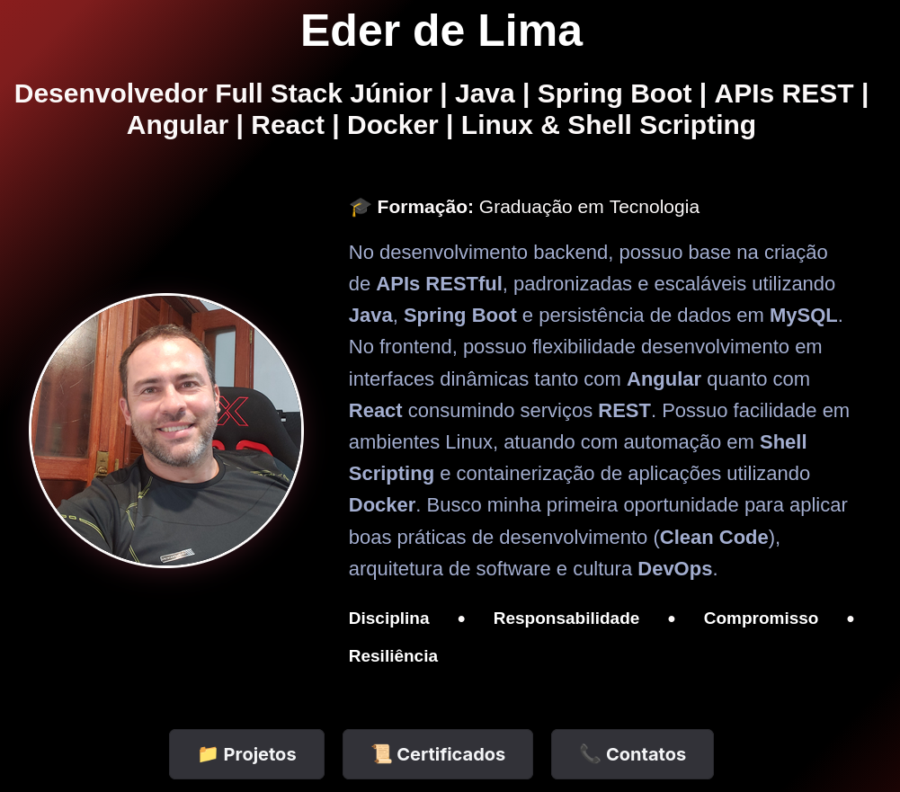

# Portfólio Acadêmico & Profissional - Front-End (Angular) 

Este repositório armazena o ecossistema visual e interativo do meu portfólio de engenharia de software. A aplicação consome dados dinamicamente de uma API RESTful em Java e renderiza uma interface reativa, responsiva e performática de alto nível.

## Link do Projeto Online
* Acesse ao sistema frontend : 
**https://github.com/EderLima88/portfolio-angular.git**
* Acesso repositótio backend java
**https://github.com/EderLima88/portfolioapi-backend.git**

---

## 🛠️ Arquitetura Visual e Tecnologias
*   **Angular 17+ Moderno**
*   **HTML5 & CSS3 Puro** 
*   **Gerenciamento de Estados com Signals:** atualizações de tela extremamente velozes.
*   **RxJS & Programação Assíncrona:** Gerenciamento dos fluxos (pipes).

---

## Soluções de Engenharia Aplicadas

###  1. UX Cold Start
Como a API RESTful está hospedada no plano gratuito do Render.com, o contêiner Docker entra em hibernação após 15 minutos de inatividade e precisa-se esperar para ver seu conteudo renderizar.
*   **Solução:** Injetei um **Spinner de Carregamento azul** em HTML/CSS reativo no `app.html` preso ao sinal `carregando()`. O usuario vê uma animação até a api esta disponível.

###  2. Proteção do Ciclo de Vida da Renderização (Resumo Invisível)
* Com este atrazo implementei o operador reativo **`pipe(delay(2000))`** do RxJS diretamente no cano de chegada do HTTP no `perfil.service.ts`. 
Isto garante 2s para o conteúdo da api chegar todos e depois renderizar. 
---

## Esteira de Integração e Entrega Contínua (CI/CD)
O projeto utiliza **GitHub Actions** configurado no arquivo `.github/workflows/deploy.yml` para automatizar as compilações diretamente no GitHub Pages sempre que uma atualização é empurrada para a ramificação oficial.

### Fluxo Definitivo de Atualização (Terminal do Fedora):
Sempre que uma alteração visual é feita na IDE, basta rodar a sequência de comandos sincronizada na branch **`master`**:

*O robô captura o sinal de push automaticamente no servidor e atualiza o site na internet em menos de 2 minutos.*

Desenvolvido por **Éder de Lima** 🎓 *Graduado em Análise e Desenvolvimento de Sistemas e Engenharia de Software*. *Pós-graduado em Desenvolvimento de Sistema com Java e Ciência de Dados.*